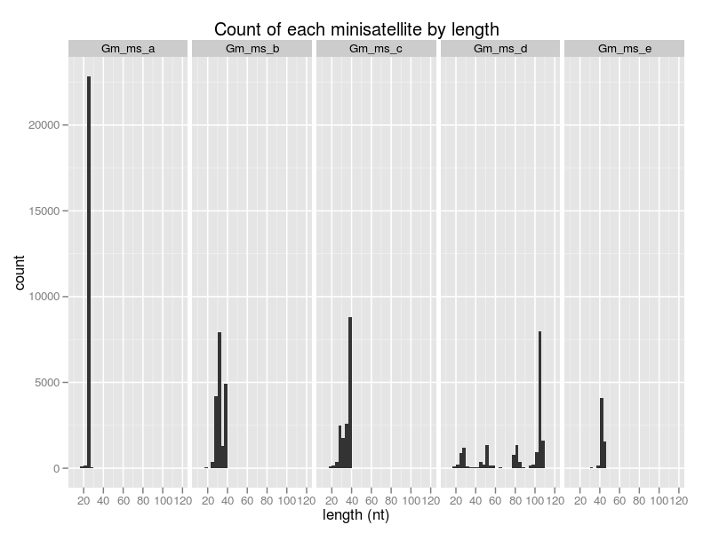
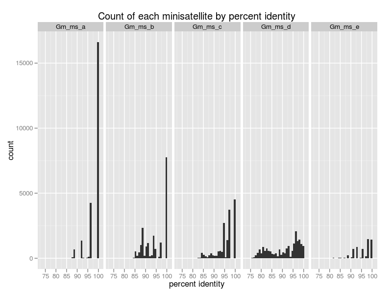
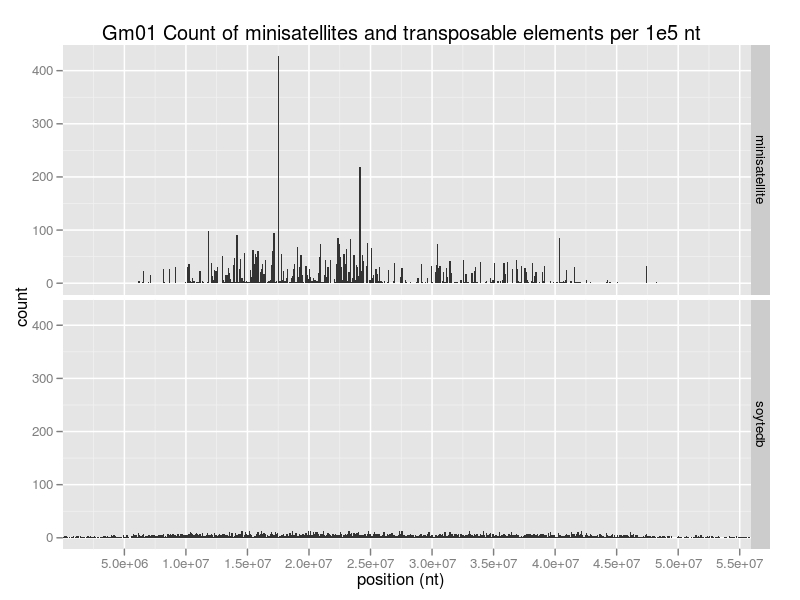

# Computational analysis of retrotransposon-associated minisatellite DNAs in the soybean genome

January 25, 2012

# Introduction

This document describes the steps required to reproduce the 
computational analysis described in the following paper:

* Mogil LM, Slowikowski K, Laten HM (2011). Computational and 
  experimental analyses of retrotransposon-associated minisatellite 
  DNAs in the soybean genome. BMC Bioinformatics, in press.

You can follow along as I describe all commands, scripts, and 
outputs. If you do follow along, make sure you `cd` to `soy-rtms` 
before executing any of the commands.

Alternatively, you can simply run `make all` to run the whole analysis:

    cd soy-rtms
    make all

The entire analysis can be generated from a small number of files 
and empty directories:

    soy-rtms/
        bin/
            analyze_putative_element_blasttable.pl
            blasttable2gff3.pl
            count_minisatellites.pl
            count_tandems.pl
            create_histograms.r
            partition_genome.pl
            soytedb2gff3.pl
        blast/ (empty)
        data/
            genome
            minisatellites.fa
        out/ (empty)
        png/ (empty)
        Makefile
        README.md

All of the steps detailed in the text below are executed by `make`, 
including downloading the soybean genome from NCBI and sequences and 
annotations from SoyTEdb. Using a makefile allows us to specify the 
rules for creation of output files and their dependencies, so `make` 
can automatically regenerate files after updates or deletions.

Please contact me with questions and suggestions.

## Overview

The goal of this analysis is to characterize the occurrence of five 
known minisatellite (MS) sequences in transposable elements (TEs) in 
the soybean genome. See the paper for more details. Please note that 
the results of this analysis will change as TE annotations are 
continually updated.

The analysis may be summarized by the following steps:

1. Download soybean chromosomes, TE annotations, and TE sequences.
2. Create two BLAST databases from the soybean genome and TE sequences.
3. Query known MS sequences against the soybean genome.
4. Create putative TEs (PEs) based on MS mappings to the soybean genome.
5. Assign TE families to each PE by comparing PEs to known TEs.
6. Count and characterize MS occurrence in TEs and PEs.

We start with five known MS sequences that occur in the Gmr9 
(GmOgre) TE family. These sequences are mapped to the soybean genome 
with BLAST. Next, we notice that many mappings are outside existing 
TE annotations. Some regions flanking these outside mappings form 
putative transposable elements that have not been reported in 
SoyTEdb. We use BLAST to compare these unnanotated putative elements 
to reported TEs, so we can to assign a probable TE family to each PE. 
Finally, MS occurrence is characterized in TEs PEs.

## Software Requirements

I performed the analysis on [Ubuntu] and have not tried to run it on 
Mac or Windows.

Software requirements:

* [Perl v5.10 or higher][perl]
    * Pre-installed on Ubuntu.
* [NCBI BLAST+][blast]
    * Install on Ubuntu with: `apt-get install ncbi-blast+`
* [BEDTools]
    * Install on Ubuntu with: `apt-get install bedtools`
* [GNU Parallel][gnuparallel]
    * Install from source, rpm, or deb.
* [The R Project for Statistical Computing][r-project]
    * Install on Ubuntu with: `apt-get install r-base-core`
* [ggplot2]
    * Install from within an R session with: `install.packages("ggplot2")`

[bedtools]: http://code.google.com/p/bedtools/
[blast]: http://blast.ncbi.nlm.nih.gov/Blast.cgi?CMD=Web&PAGE_TYPE=BlastDocs&DOC_TYPE=Download
[ggplot2]: http://had.co.nz/ggplot2/
[gnuparallel]: http://www.gnu.org/software/parallel/
[perl]: http://www.perl.org/
[r-project]: http://www.r-project.org/
[ubuntu]: http://www.ubuntu.com/

## Directory Structure

Scripts located in `bin` are run against data in `blast` and `data` 
and generate output in `out`.

    soy-rtms
    ├── bin
    │   ├── analyze_putative_element_blasttable.pl
    │   ├── blasttable2gff3.pl
    │   ├── count_minisatellites.pl
    │   ├── count_tandems.pl
    │   ├── create_histograms.r
    │   ├── partition_genome.pl
    │   └── soytedb2gff3.pl
    ├── blast
    │   ├── soy.nhr
    │   ├── soy.nin
    │   ├── soy.nsq
    │   ├── soytedb.nhr
    │   ├── soytedb.nin
    │   └── soytedb.nsq
    ├── data
    │   ├── genome
    │   ├── minisatellites.fa
    │   ├── soy.fa
    │   ├── soy.fa.fai
    │   ├── soytedb.fa.bz2
    │   ├── soytedb.gff3.bz2
    │   └── soytedb.tab.bz2
    ├── out
    │   ├── minisatellite_counts.tab
    │   ├── minisatellites.blasttable.bz2
    │   ├── minisatellites.gff3.bz2
    │   ├── putative_elements.bed.bz2
    │   ├── putative_elements.fa.bz2
    │   ├── putative_elements.gss.blasttable.bz2
    │   ├── putative_elements.soy.blasttable.bz2
    │   ├── putative_elements.soytedb.blasttable.bz2
    │   ├── putative_elements.soytedb.blasttable.gff3.bz2
    │   ├── putative_elements.soytedb.blasttable.tab.bz2
    │   ├── soy.hist.bed.bz2
    │   ├── soy.minisatellites.hist.bz2
    │   ├── soy.soytedb.hist.bz2
    │   └── tandem_counts.tab
    ├── png
    │   ├── Gm01_histogram.png
    │   ├── Gm02_histogram.png
    │   ├── Gm03_histogram.png
    │   ├── Gm04_histogram.png
    │   ├── Gm05_histogram.png
    │   ├── Gm06_histogram.png
    │   ├── Gm07_histogram.png
    │   ├── Gm08_histogram.png
    │   ├── Gm09_histogram.png
    │   ├── Gm10_histogram.png
    │   ├── Gm11_histogram.png
    │   ├── Gm12_histogram.png
    │   ├── Gm13_histogram.png
    │   ├── Gm14_histogram.png
    │   ├── Gm15_histogram.png
    │   ├── Gm16_histogram.png
    │   ├── Gm17_histogram.png
    │   ├── Gm18_histogram.png
    │   ├── Gm19_histogram.png
    │   ├── Gm20_histogram.png
    │   ├── minisatellites_identity_histogram.png
    │   └── minisatellites_length_histogram.png
    ├── Makefile
    └── README.md

### Detailed Description of All Files

You can safely skip this section and follow along with the analysis, 
but it is provided for your convenience to quickly understand each
file.

* `soy-rtms` is the root folder from which all commands should be performed.
* `bin` contains executable scripts.

    * `analyze_putative_element_blasttable.pl` reads a BLAST table
    of results from the query of putative elements against the genome
    and outputs a tab-delimited format summarizing matching TE families
    for each PE or a GFF3 format with TE families assigned. See output
    in `putative_elements.soy.blasttable.tab.bz2` and
    `putative_elements.soy.blasttable.gff3.bz2`.

    * `blasttable2gff3.pl` converts BLAST `-outfmt 7` to GFF3.

    * `count_minisatellites.pl` accepts output from `intersectBed` and 
    outputs a table of MS counts in each TE family. See output in
    `out/minisatellite_counts.tab`.

    * `count_tandems.pl` accepts output from `mergeBed` and outputs 
    tandem patterns of minisatellites. See output in 
    `out/tandem_counts.tab`.

    * `create_histograms.r` is an R script to create the histograms 
    found in `png`.

    * `partition_genome.pl` accepts a tab-delimited genome file with
    lengths of each chromosome and outputs BED data with equal-size
    annotations that are used as bins to create the histograms. See
    output in `out/soy.hist.bed.bz2`.

    * `soytedb2gff3.pl` converts SoyTEdb tab-delimited format to 
    GFF3. See input in `data/soytedb.tab.bz2` and output in 
    `data/soytedb.gff3.bz2`.

* `blast` contains two BLAST databases: soy and soytedb.
* `data` contains input sequences and tab-delimited data files.

    * `genome` contains chromosome names and lengths.

    * `minisatellites.fa` contains MS sequences.

    * `soy.fa` contains the soybean chromosome sequences.

    * `soy.fa.fai` is an index created by BEDTools.

    * `soytedb.fa.bz2` contains sequences for all SoyTEdb TEs.

    * `soytedb.gff3.bz2` is the GFF3 form of `soytedb.tab.bz2`.

    * `soytedb.tab.bz2` contains annotations for all SoyTEdb TEs.

* `out` contains output files from this analysis.

    * `minisatellite_counts.tab` shows MS, TE, and PE counts for
    each TE family that contains MS hits.

    * `minisatellites.blasttable.bz2` is the ouput from a BLAST query
    of MSs against the genome.

    * `minisatellites.gff3.bz2` is the BLAST table converted to GFF3.

    * `putative_elements.bed.bz2` is a list of annotations representing
    PEs in the soybean genome, based on MS BLAST hit loci.

    * `putative_elements.fa.bz2` contains nucleotide sequences for all
    PEs.

    * `putative_elements.gss.blasttable.bz2` is the output from a BLAST
    query of PEs against NCBI's GSS database.

    * `putative_elements.soy.blasttable.bz2` is the output from a BLAST
    query of PEs against the soybean genome.

    * `putative_elements.soytedb.blasttable.bz2` is the output from a
    BLAST query of PEs against TEs reported by SoyTEdb.

    * `putative_elements.soytedb.blasttable.gff3.bz2` is the output
    from `analyze_putative_element_blasttable.pl` where each PE is
    assigned a TE family.

    * `putative_elements.soytedb.blasttable.tab.bz2` is an intermediate
    tab-delimited format showing a summary of PE BLAST hits against
    TE families.

    * `soy.hist.bed.bz2` is the output from `partition_genome.pl` and
    contains equal-sized BED entries used as bins to create histograms.

    * `soy.minisatellites.hist.bz2` is a count of MS hits in each bin.

    * `soy.soytedb.hist.bz2` is a count of SoyTEdb TEs in each bin.

    * `tandem_counts.tab` is the output from `count_tandems.pl` and
    contains the tandem (contiguous) patterns exhibited by the
    minisatellites.

* `png` contains histograms.

    * `Gm??_histogram.png` where ?? is 01-20 shows MS and TE positions
    across all the soybean chromosomes.

    * `minisatellites_identity_histogram.png` shows BLAST hit
    percent identities for MS BLAST hits against the genome.

    * `minisatellites_length_histogram.png` shows BLAST hit
    lengths for MS BLAST hits against the genome.

----

# Data

Four pieces of data are used in this analysis:

1. The soybean genome.
2. Five known minisatellite sequences.
3. Transposable element annotations.
4. Transposable element sequences.

Assemblies of the 20 soybean (Glycine max) chromosomes are acquired 
from NCBI Genbank. Transposable element coordinates and sequences 
are acquired from the [Soybean Transposable Element 
Database][soytedb]. 

See the following publications for more information about the 
annotated transposable elements:

* [Genome sequence of the palaeopolyploid soybean][genome_paper]
* [SoyTEdb: a comprehensive database of transposable elements in the soybean genome][soytedb_paper]

There are hundreds of thousands of truncated or degenerate elements 
for which we have no current annotations (see Table S6 in the 
[supplementary information][genome_paper_supp] of the soybean genome 
paper). The elements listed on SoyTEdb have clear boundaries that 
make them easier to find and annotate.

[genome_paper]: http://dx.doi.org/10.1038/nature08670
[soytedb_paper]: http://dx.doi.org/10.1186/1471-2164-11-113
[genome_paper_supp]: http://www.nature.com/nature/journal/v463/n7278/suppinfo/nature08670.html
[soytedb]: http://soytedb.org/

## Download Sequences and Annotations

Download the soybean chromosomes with the following command, taking
advantage of NCBI's E-Utils. Perl is used to change the header line
of each FASTA entry to match the chromosome names used at SoyTEdb.

    ids=283570573,283570572,283570571,283570570,283570569,283570568,283570567,283570566,283570565,283570564,283570563,283570562,283570561,283570560,283570559,283570558,283570557,283570556,283570555,283570554
    wget -O - "http://eutils.ncbi.nlm.nih.gov/entrez/eutils/efetch.fcgi?db=nucleotide&rettype=fasta&id=$ids" | \
    perl -pe 'BEGIN{ $$i="01" } s/^>.*/>Gm$$i/ && $$i++' > data/soy.fa

Download the TE annotations and sequences with the following commands.

    wget -O - "http://www.soybase.org/soytedb/Dump.php?type=summary" | \
    bzip2 > data/soytedb.tab.bz2

    wget -O - "http://www.soybase.org/soytedb/Dump.php?type=fasta" | \
    bzip2 > data/soytedb.fa.bz2

Convert from SoyTEdb's tab-delimited format to GFF3 so BEDTools can
operate on this data.

    ./bin/soytedb2gff3.pl < <(bzcat data/soytedb.tab.bz2) | \
    bzip2 > data/soytedb.gff3.bz2

## Minisatellite Sequences

The five MS sequences are provided in `data/minisatellites.fa`.

    >Gm_ms_a
    TCATCCAGAGGCGGCGGGCCCGATGA

    >Gm_ms_b
    CAAGCAGAGACCAAGTTTGGTCATTCTGCACCCTTGTA

    >Gm_ms_c
    TACGCGGAGATACCTTACGGTTATCCGCACCCTTTTG

    >Gm_ms_d
    TGTCATACCCTAATTTCGTCCGGGGACCTTTGCTTGATGACATGCGACCT
    TTCTTTGGTCCTTGTGAGGTGCTTGGCACCCATCATTAGGCAATTTGTGA
    AATTC

    >Gm_ms_e
    ATGGTCACCCGCGACTCTCGTCAACCGAGAGGAGCGAAATTAG

----

# Analysis

## Create BLAST Databases

Create BLAST databases `blast/soy` and `blast/soytedb` for the 
soybean genome `data/soy.fa` and for the soyTEdb elements 
`data/soytedb.fa.bz2`:

    cat data/soy.fa | \
    makeblastdb -dbtype nucl -title soy -out blast/soy

    bzcat data/soytedb.fa.bz2 | \
    makeblastdb -dbtype nucl -title soytedb -out blast/soytedb

## Map Minisatellite Sequences

Map the five minisatellite sequences to the soybean genome by 
performing a BLAST search against the soybean genome:

    blastn \
    -query data/minisatellites.fa \
    -db blast/soy \
    -word_size 4 \
    -num_threads 2 \
    -outfmt 7 | \
    bzip2 > out/minisatellites.blasttable.bz2

Option `-word_size` must be set low to get results for short 
queries. The minimum setting is 4. Set `-num_threads` to the number 
of available cores in your CPU to speed up the search.

Prepare to make a histograms of BLAST hit quality, hit positions in 
the genome, and TE positions in the genome:

    # Convert the BLAST hits to GFF3.
    ./bin/blasttable2gff3.pl < <(bzcat out/minisatellites.blasttable.bz2) | \
    bzip2 > out/minisatellites.gff3.bz2

    # Partition the genome into a BED file with 100k nt bins
    ./bin/partition_genome.pl data/genome 100000 | \
    bzip2 > soy.hist.bed.bz2

    # Count MS BLAST hits in each 100k nt bin.
    coverageBed \
    -a <(bzcat out/minisatellites.gff3.bz2) \
    -b <(bzcat out/soy.hist.bed.bz2) | \
    bzip2 > out/soy.minisatellites.hist.bz2

    # Count TEs in each 100k nt bin.
    coverageBed \
    -a <(bzcat data/soytedb.gff3.bz2) \
    -b <(bzcat out/soy.hist.bed.bz2) | \
    bzip2 > out/soy.soytedb.hist.bz2

### Create BLAST Hit Histograms

Use R to create histograms:

    R --slave --no-save < bin/create_histograms.r

This creates the following histograms:

* MS hit lengths, for each of the five MSs
* MS hit percent identities, for each of the five MSs
* MS count and TE count per 100k nt, for each of the 20 chromosomes

with corresponding files:

* `png/minisatellites_length_histogram.png`
* `png/minisatellites_identity_histogram.png`
* `png/Gm??_histogram.png` where ?? is 01 through 20

#### Histogram: MS Hit Length

#### Histogram: MS Percent Identity

#### Histogram: MS and TE Count per 100k nt

## Find Putative Transposable Elements

Some MS hits do not overlap TEs from soyTEdb, but they might be 
overlapping the hundreds of thousands of copies of degenerate TEs 
that are not reported on soyTEdb.

In order to identify the families of the unreported TEs, we save the 
surrounding sequences from non-overlapping MS hits as putative 
elements (PEs) and compare them to known TEs. We create them by the 
following procedure:

~~~
TEs:    ------                               -------------
MSs:        ||        | |        || |               |  || 
~~~

* exclude MS hits that overlap known TEs

~~~
TEs:    ------                               -------------
MSs:                  | |        || |                     
~~~

* group MS hits that are less than 1000 nt from each other into
putative elements (PEs)

~~~
TEs:    ------                               -------------
PEs:                  ---        ----                     
~~~

* extend each PE 500 nt upstream and 500 nt downstream

~~~
TEs:    ------                               -------------
PEs:                -------    --------                   
~~~

Create the putative elements:

    # Create putative element annotations in BED format.
    intersectBed -v \
    -a <(bzcat out/minisatellites.gff3.bz2) \
    -b <(bzcat data/soytedb.gff3.bz2) | \
    mergeBed -d 1000 | \
    slopBed -g data/genome -b 500 | \
    bzip2 > out/putative_elements.bed.bz2

    # Retreive putative element sequences from the genome.
    bzcat out/putative_elements.bed.bz2 | \
    fastaFromBed -bed stdin -fi data/soy.fa -fo stdout | \
    bzip2 > out/putative_elements.fa.bz2

## Assign TE Families to Putative Elements

We decide if putative elements belong to known TE families by using 
BLAST to compare the putative elements to the soyTEdb elements.

We'll complete the following steps:

1. BLAST all putative elements (PEs) against soyTEdb elements (TEs).
2. Assign TE families to PEs that have a high similarity to soyTEdb 
TEs. Some PEs will not be assigned families.
    * BLAST unassigned PEs against the soybean genome to determine if 
    they are repetitive or not.
    * If a PE has too few hits against the soybean genome, BLAST it 
    against NCBI's GSS database to see if it matches repetitive 
    sequences there.

### BLAST Putative Elements against soyTEdb

BLAST the putative elements against the soyTEdb elements to check if 
any of them can be assigned to known families. We perform the search 
with assistance from GNU parallel. There is one important advantage 
when using GNU parallel as shown below: each search result is output 
as soon as it is completed. Without GNU parallel, no output is 
produced until all searches are completed, so more memory is used 
because all search results must be held in memory.

    bzcat out/putative_elements.fa.bz2 | \
    parallel --pipe --recstart '>' -N1 \
    blastn -db blast/soytedb -outfmt 7 | \
    bzip2 > out/putative_elements.soytedb.blasttable.bz2

We tell GNU parallel to read blocks of data from `stdin` as input to 
each job with option `--pipe`. Option `--recstart '>'` further 
specifies that a block should not be the default 1M chunk of data 
but instead should be a record that starts with the `>` character. 
Option `-N1` enforces that a single record (FASTA sequence) is sent 
to each job.

See [here](http://www.gnu.org/software/parallel/man.html) for more 
examples of how to use GNU Parallel.

### Assign Families to Putative Elements

Next, we analyze the BLAST table and assign soyTEdb families to each 
PE. Recall that our procedure for creating PEs includes grouping MS 
hits less than 1000 nt from each other and then extending the groups 
with 500 nt flanks. We assign TE families by counting the number of 
good alignments between each PE's flanks and soyTEdb TEs.

We count two kinds of BLAST hits:

* against the MS group (the interior of the PE)
* against the PE's flanks

Hits against the MS group with identity over 80% are as so-called 
matches. For hits against the flanks, we count a hit as a match when 
two conditions are met: the identity is over 80% and the hit is at 
least 400 nt in length.

Each putative element is assigned to the soyTEdb family with the most
flank matches.

Analyze the BLAST table:

    bzcat out/putative_elements.blasttable.bz2 | \
    ./bin/analyze_putative_element_blasttable.pl | \
    bzip2 > out/putative_elements.soytedb.blasttable.tab.bz2

Let's see the output:

~~~
bzcat out/putative_elements.soytedb.blasttable.tab.bz2 | head | column -t -s$'\t'
query_id                ms_hits  >80%  fl_hits  >80% && >400nt  families  max_family  fl_matches
Gm11:13042530-13043611  0        0.00  391      0.92            5         Gmr9        341         Gmr21  15   Gmr3    2  Gmr19  1  Gmr79  1  NA     0
Gm19:16003850-16006944  6925     0.97  1360     0.56            2         Gmr9        757         Gmr3   2    NA      0
Gm05:20660383-20661464  1        1.00  428      0.93            8         Gmr9        350         Gmr5   43   Gmr235  1  Gmr4   1  Gmr3   1  Gmr19  1  Gmr139  1  Gmr35  1  NA  0
Gm19:13021834-13022886  0        0.00  399      0.92            5         Gmr4        261         Gmr9   103  Gmr6    1  Gmr34  1  Gmr25  1  NA     0
Gm14:22142619-22143700  0        0.00  1313     0.33            5         Gmr9        430         Gmr37  2    Gmr1    1  Gmr3   1  Gmr19  1  NA     0
Gm09:24127853-24128877  0        0.00  399      0.46            4         Gmr9        180         Gmr6   2    Gmr3    1  Gmr25  1  NA     0
Gm08:45870500-45871516  0        0.00  0        0.00            0         NA          0
Gm03:16897698-16898743  5        1.00  621      0.69            5         Gmr9        424         Gmr4   1    Gmr6    1  Gmr19  1  Gmr35  1  NA     0
Gm01:34877128-34878229  0        0.00  451      0.04            2         Gmr9        18          Gmr25  1    NA      0
~~~

The second PE has 6925 hits against the minisatellite group and 1360 
hits against its flanks. 97% of the MS group hits have identity over 
80% and 56% of flank hits meet two conditions: identity over 80% and 
length over 400 nt. The PE has flank matches for two soyTEdb 
families: 757 against Gmr9 and 2 against Gmr3.

We assign the PE to the family with the most flank matches. There are
certainly more accurate ways to assign PEs to families.

The option `--gff3` for my script 
`analyze_putative_element_blasttable.pl` enables a simpler output in 
GFF3 format where each PE is assigned a unique id and a family:

    bzcat out/putative_elements.blasttable.bz2 | \
    ./bin/analyze_putative_element_blasttable.pl --gff3 | \
    bzip2 > out/putative_elements.soytedb.blasttable.gff3.bz2

    bzcat out/putative_elements.soytedb.blasttable.gff3.bz2 | head | column -t -s$'\t'
    Gm11  Perl  pe_Gmr9_Gm11-1    13042530  13043611  .  .  .  .
    Gm19  Perl  pe_Gmr9_Gm19-2    16003850  16006944  .  .  .  .
    Gm05  Perl  pe_Gmr9_Gm05-3    20660383  20661464  .  .  .  .
    Gm19  Perl  pe_Gmr4_Gm19-1    13021834  13022886  .  .  .  .
    Gm14  Perl  pe_Gmr9_Gm14-4    22142619  22143700  .  .  .  .
    Gm09  Perl  pe_Gmr9_Gm09-5    24127853  24128877  .  .  .  .
    Gm08  Perl  pe_NA_Gm08-1      45870500  45871516  .  .  .  .
    Gm03  Perl  pe_Gmr9_Gm03-6    16897698  16898743  .  .  .  .
    Gm01  Perl  pe_Gmr9_Gm01-7    34877128  34878229  .  .  .  .
    Gm04  Perl  pe_Gmr540_Gm04-1  31182342  31183369  .  .  .  .

Next, we BLAST the unassigned putative elements against the soybean 
genome to check if they are repetitive:

    bzcat out/putative_elements.blasttable.gff3.bz2 | \
    grep _NA_ | \
    fastaFromBed -bed stdin -fi data/soy.fa -fo stdout | \
    blastn -db blast/soy -outfmt 7 | \
    bzip2 > out/putative_elements.soy.blasttable.bz2

If the putative element has less than 10 hits against the soybean 
genome, BLAST it against NCBI's GSS database:

    bzcat out/putative_elements.soy.blasttable.bz2 | \
    grep -v '^#' | \
    perl -wanE '$H{$F[0]}++;END{map {say join "\t", split /[:-]/ if $H{$_}<10} keys %H}' | \
    fastaFromBed -bed stdin -fi data/soy.fa -fo stdout | \
    blastn -remote -db gss -entrez_query '"Glycine max"[porgn:__txid3847]' -outfmt 7 | \
    bzip2 > out/putative_elements.gss.blasttable.bz2

Check how many hits those PEs have against NCBI's GSS:

    bzcat out/putative_elements.gss.blasttable.bz2 | \
    perl -ne '(/^# Query/ || /hits found/) && print'
    # Query: Gm01:55170562-55171583
    # 4 hits found
    # Query: Gm12:37432268-37433286
    # 1 hits found
    # Query: Gm07:38133060-38134078
    # 0 hits found
    # Query: Gm07:4969896-4970912
    # 1 hits found
    # Query: Gm03:33202309-33203326
    # 4 hits found
    # Query: Gm05:28480938-28481956
    # 3 hits found
    # Query: Gm15:7083998-7085018
    # 0 hits found
    # Query: Gm01:2860009-2861046
    # 0 hits found
    # Query: Gm10:39991550-39992570
    # 0 hits found
    # Query: Gm03:36053279-36054296
    # 0 hits found
    # Query: Gm18:1732265-1733285
    # 0 hits found

## Count Minisatellites in SoyTEdb Elements and Putative Elements

Count minisatellites in TEs and PEs and output a table of MS
occurrence for each TE family:

    bzcat data/soytedb.gff3.bz2 out/putative_elements.soytedb.blasttable.gff3.bz2 | \
    intersectBed -a <(bzcat out/minisatellites.gff3.bz2) -b stdin -wo | \
    ./bin/count_minisatellites.pl > out/minisatellite_counts.tab

Let's have a look at part of the output:

    family  A      Ape   Ae    Aeps  B      Bpe  Be    Beps  C      Cpe  Ce    Ceps  D     Dpe   De    Deps  E     Epe  Ee    Eeps
    Gmr9    22249  1031  1749  0.00  13918  712  1598  0.00  14201  988  1725  0.00  9417  1752  2591  0.21  5451  720  1707  0.00
    Gmr139  0      0     0     0.00  0      0    0     0.00  4      3    1     0.00  707   473   189   0.60  1     0    1     0.00
    Gmr4    22     4     3     0.00  9      0    2     0.00  29     15   1     0.00  183   159   15    0.33  2     0    2     0.00
    NA      4      4     0     0.00  13     13   0     0.00  12     10   0     0.00  195   194   0     0.00  1     1    0     0.00
    Gmr338  0      0     0     0.00  0      0    0     0.00  0      0    0     0.00  212   162   36    0.64  0     0    0     0.00
    Gmr6    69     3     4     0.00  20     0    4     0.00  47     3    6     0.00  44    24    9     0.00  15    0    5     0.00

TE family Gmr9 has the most minisatellites, followed by family 
Gmr139. There are 22,249 copies of minisatellite A (with BLAST hit 
percent identity >=90%) in elements that belong to family Gmr9. 
These copies are present in 1,031 putative Gmr9 elements and 1,749 
SoyTEdb elements. None of the 1,749 elements are described as SOLO 
elements. On the other hand, 21% of the 2,591 TEs containing 
minisatellite D are described as SOLO elements.

## Count Tandem Minisatellite Patterns

When the minisatellites appear in a TE, they are usually found in a 
repetitive contiguous pattern like `ABAC ABAC ABAC`. We use BEDTools 
to merge minisatellite BLAST hits that are less than 5 nt away from 
each other and then pipe the merged entries to `count_tandems.pl`. 
The output describes all of the kinds of tandem patterns we see.

    mergeBed -i <(bzcat out/minisatellites.gff3.bz2) -d 5 -nms | \
    cut -f4 | ./bin/count_tandems.pl > out/tandem_counts.tab

Let's have a look at part of the output:

    1  ABAC  37  149  ABACABACABACABACABACABACABACABACABACABACABACABACABACABACABACABACABACABACABACABACABACABACABACABACABACABACABACABACABACABACABACABACABACABACABACABACABACA
    1  BAC   43  137  CABACBACBACBACBACBACBACBABACBACBACBACBACBACBACBACBACBACBACBACBACBACBACBACBACBACBACBACBACBABACBACBACBACBACBACBACBACBACBABACBACBACBACBACBAC
    1  CAB   29  90   CABCABCABCABCABCABCABCABCABCABCABCABCABCABCABCABCABCABCABCABCABCABCABCABCABCABCABCABCACABA
    1  CAB   27  82   CABCABCABCABCABCABCABCABCABCABCABCABCABCABCABCABCABCABCABCABCABCABCABCABCABCABCABA
    1  ABAC  19  79   ACABACABACABACABACABACABACABACABACABACABACABACABACABACABACABACABACABACABACABACA
    1  ABAC  17  75   ABACABACACABACABABACABABACABACABACABACABACABACABACABACABACABACABACABACABACA
    1  ABAC  16  69   ABACABACACABACABACABACABACABACABACABACACABACABACABACABACABACABACABACA
    1  ABC   22  66   ABCABCABCABCABCABCABCABCABCABCABCABCABCABCABCABCABCABCABCABCABCABC
    1  ACAB  15  65   ACABACABABACABACABACABACABACABACABACABACABACABABACABACABACABACABA
    1  ABAC  14  59   ABABACABACABACABACABACABACABACABACABACABACABACABACABACABACA

There exists 1 instance of a 149-monomer tandem of contiguous 
minisatellites in the soybean genome. It has a repetitive word 
`ABAC` that appears 37 times.
